# js-gallery

"js-gallery" is a javascript library to help you arrange your photos nicely.

# DEMO

You'll understand how Js-gallery arranges your photos. The array of photos is based on Facebook. you can generate as many galleries as you like on one page.

## ONE
When you only upload one photo

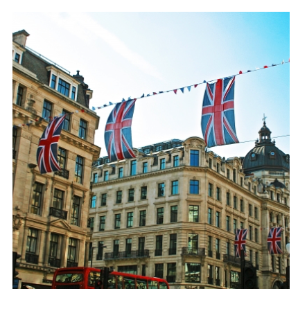

## TWO
### square pattern
When they're both square

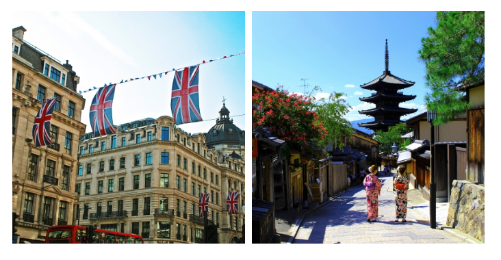

### landscape pattern
When both photos are in landscape mode

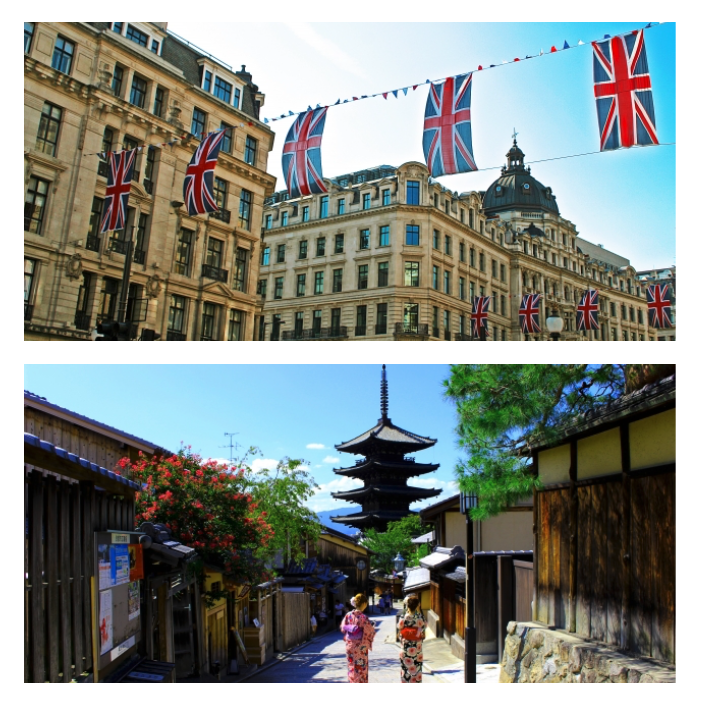

### portrait pattern
When even one photo is portrait mode

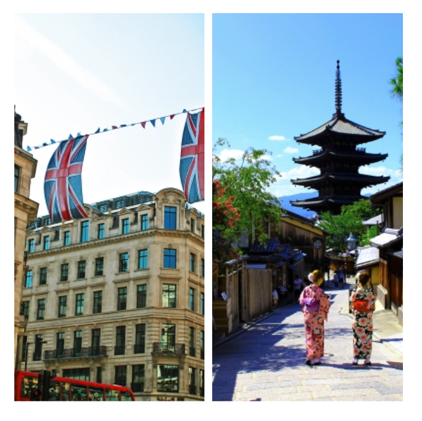

## THREE
### landscape pattern
When the first picture is landscape mode

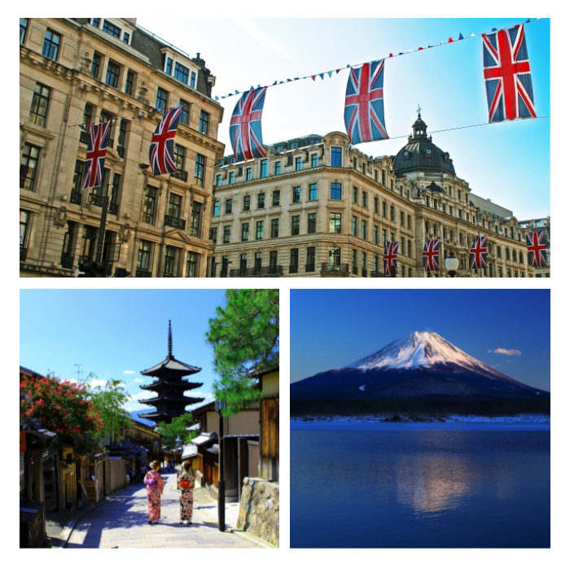

### portrait pattern
When the first picture is portrait mode

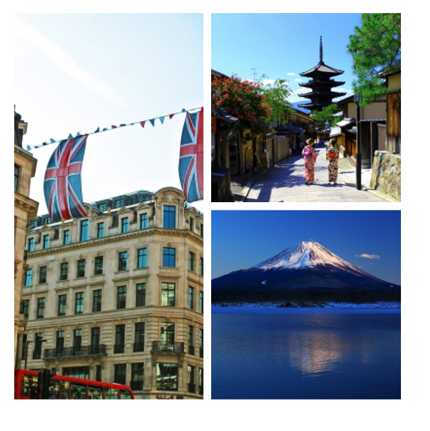

## FOUR
### square pattern
When they're all square

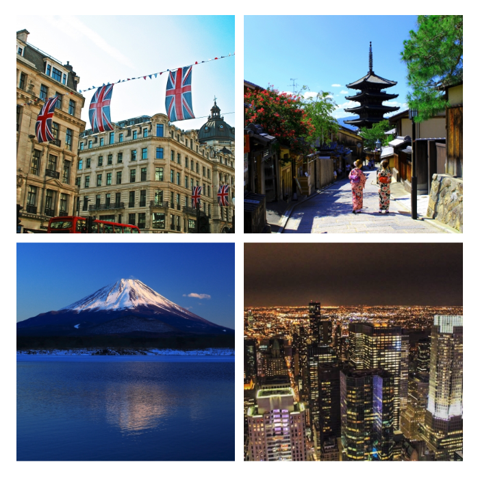

### landscape pattern
When the first picture is landscape mode

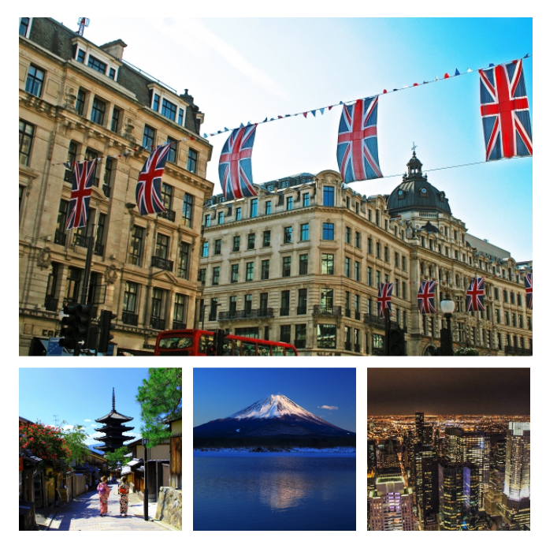

### portrait pattern
When the first picture is portrait mode

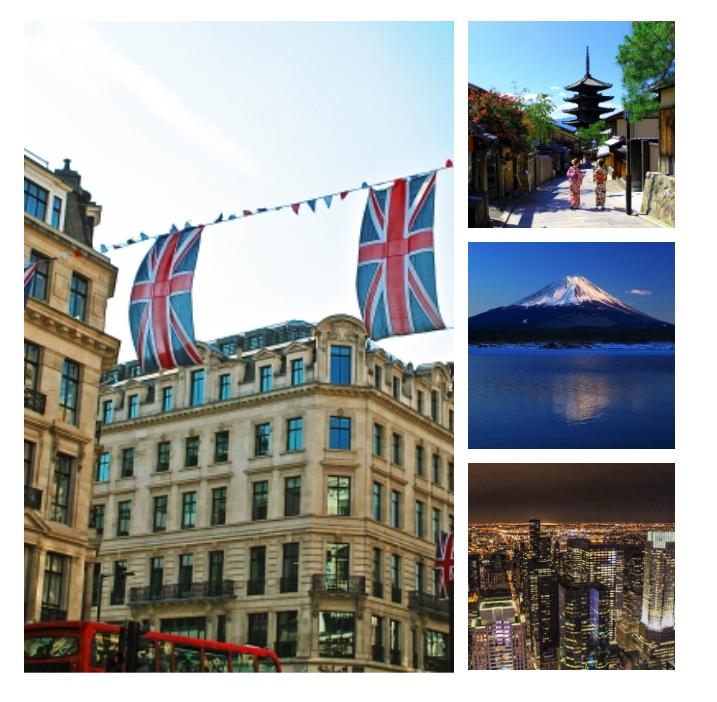

## FIVE
When there are five photos, there is one pattern.

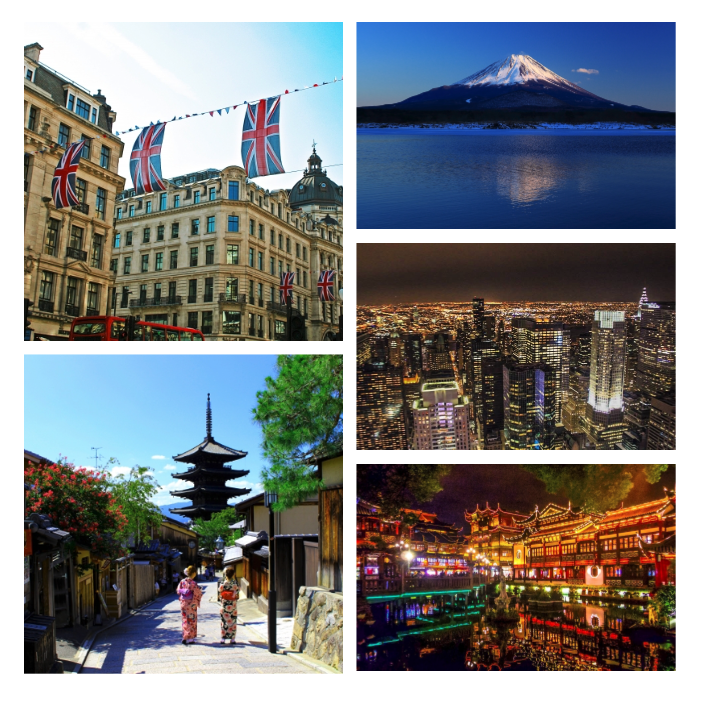

## SIX or MORE
If you have 6 or more photos, the number of photos remaining will be expressed as a number. The example below shows how to upload 7 photos.

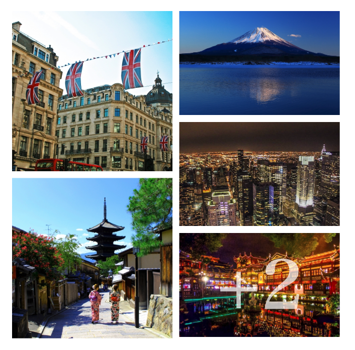

## OPTION
Click on any of the photos to see a list of photos. The list will also show the excess photos that are not shown. This function is based on [appple/SmartPhoto](https://github.com/appleple/SmartPhoto).
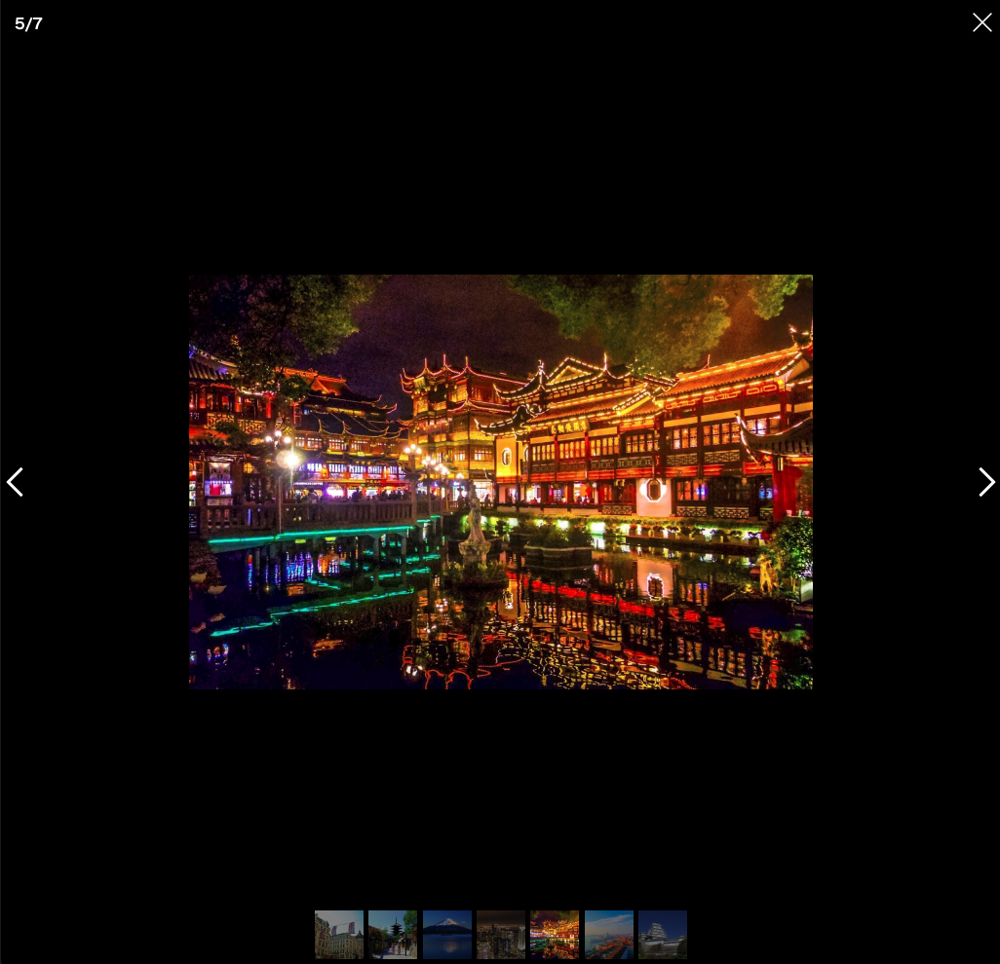

You can change the width and color of the border as you wish. By default, the numbers are set to the same color as the border.

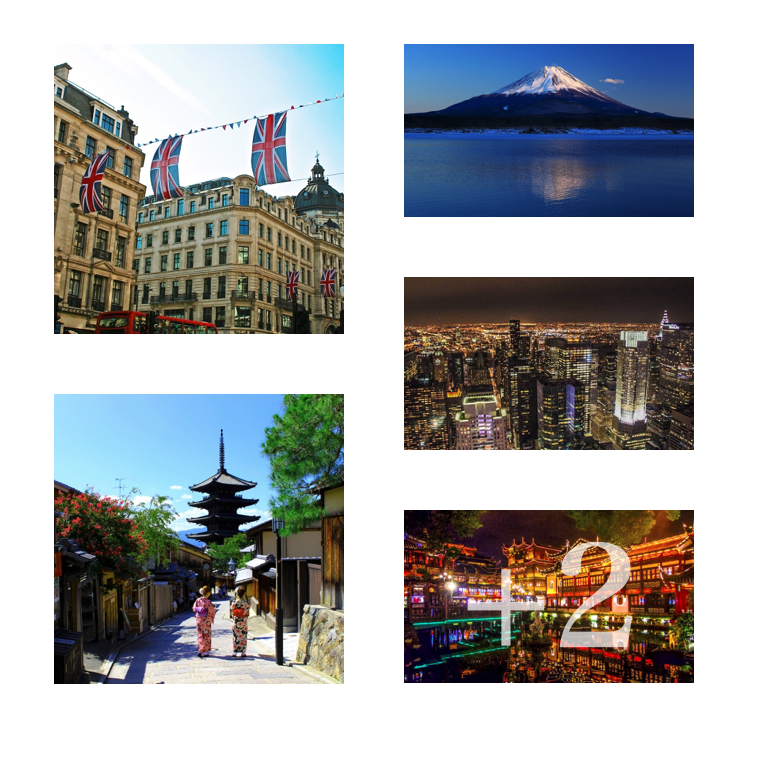
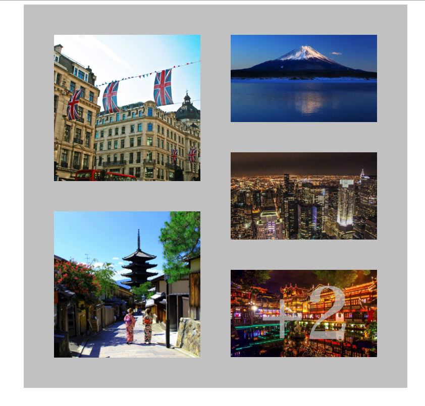


# Usage
## 1. Please set up the following to be loaded from the html file.
   -  favorite css
   -  gallery.js (if you use box-sizing:borderBox, you should load borderBox-gallery.js)
   -  script.js
   -  [appple/SmartPhoto](https://github.com/appleple/SmartPhoto)

## 2. It forms an html structure as follows
```HTML
<body>

  <div class="js-gallery">
    <div>
      <a href="./image/1.jpg" class="js-smartPhoto" data-group="gellery">
        
      </a>
    <div>
      <a href="./image/2.jpg" class="js-smartPhoto" data-group="gellery">
        
      </a>
    </div>

    .
    .
    .

    <div>
      <a href="./image/7.jpg" class="js-smartPhoto" data-group="gellery">
        
      </a>
    </div>
  </div>

  <script src="https://unpkg.com/smartphoto@latest/js/smartphoto.min.js"></script>
  <script type="text/javascript" src="./js/script.js"></script>
  <script type="text/javascript" src="./js/gallery.js"></script>

</body>
```
  -  Add a js-gallery class to the outermost div.
  -  Add a class called js-smartPhoto to the div that covers each item. This is a setup for using [appple/SmartPhoto](https://github.com/appleple/SmartPhoto). See [appple/SmartPhoto](https://github.com/appleple/SmartPhoto) for other details.

## 3. Default
Write the following in your script.js
```javascript
new Gallery('js-gallery');
```

## 4. Options
SIZE : gallery size  
BORDER : border width  
BORDERCOLOR : background and number color
```javascript
new Gallery('js-gallery',{
  SIZE:700,
  BORDER:30,
  BORDERCOLOR:'white'
});
```
# Author
Yu Nobuoka
